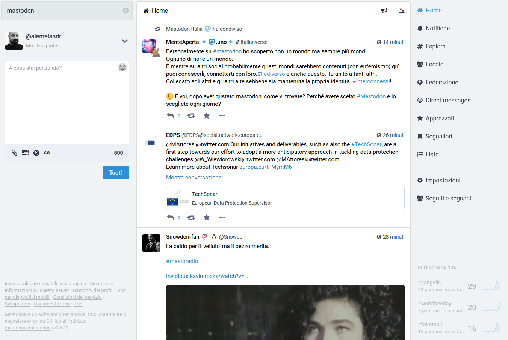
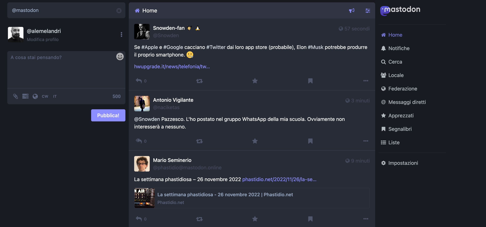
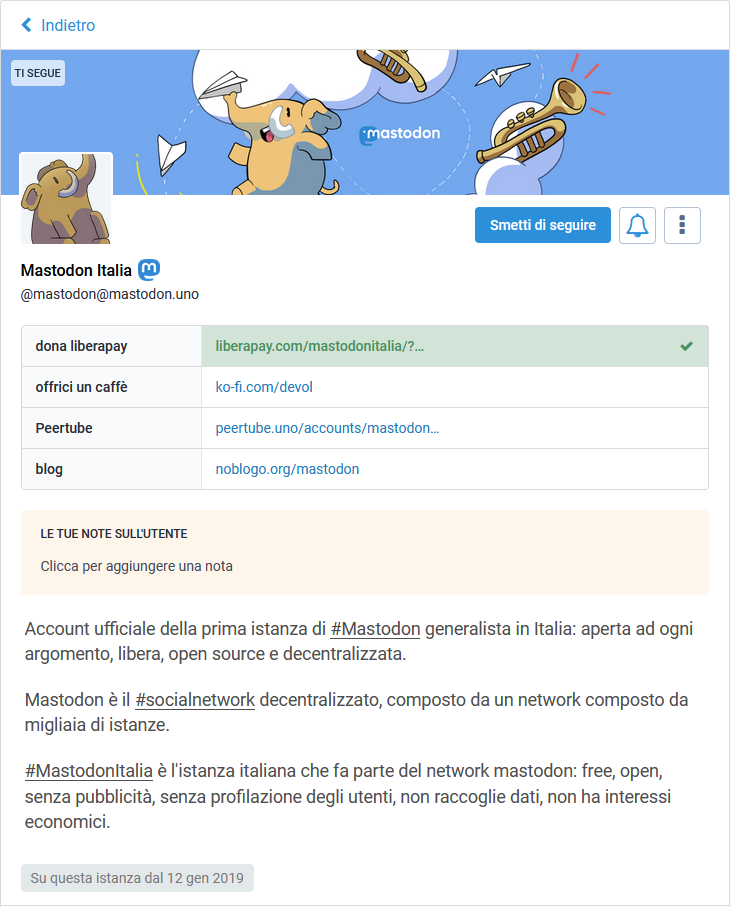
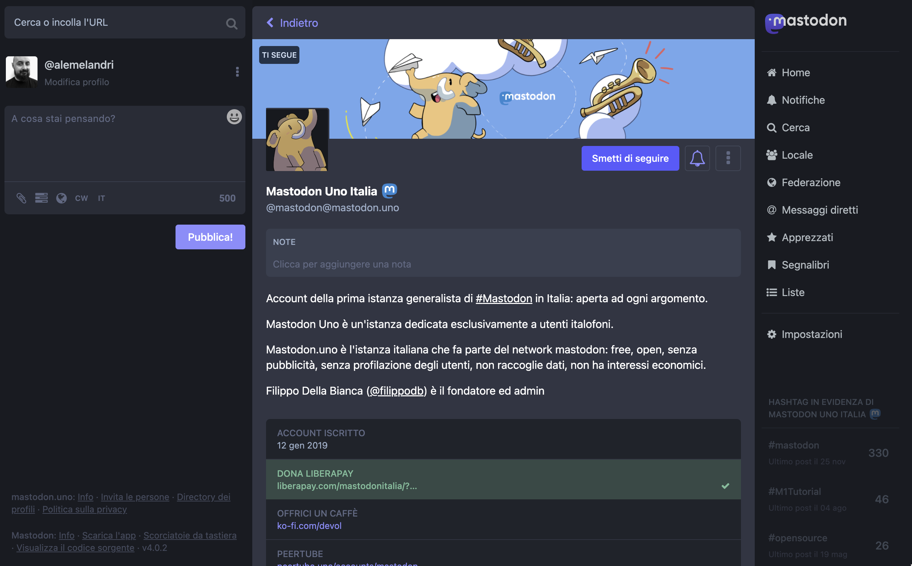

# Mastodon Custom Style sheet

This is a customization of the default Mastodon style sheet.

Install Stylus or Stylebot in your browser to use it.

## Homepage

### Light theme

### Dark theme

## Profile page

### Light theme

### Dark theme

